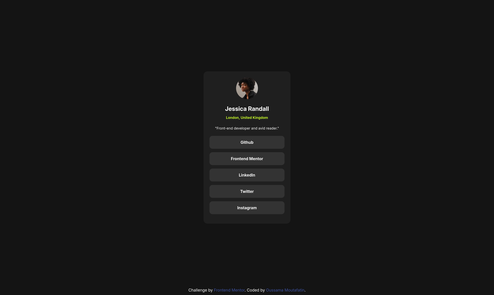

# Frontend Mentor - Recipe page solution

This is a solution to the [Social links profile challenge on Frontend Mentor](https://www.frontendmentor.io/challenges/social-links-profile-UG32l9m6dQ). Frontend Mentor challenges help you improve your coding skills by building realistic projects.

## Table of contents

- [Overview](#overview)
  - [The challenge](#the-challenge)
  - [Screenshot](#screenshot)
  - [Links](#links)
- [My process](#my-process)
  - [Built with](#built-with)
  - [What I learned](#what-i-learned)
- [Future Improvements](#future-improvements)

## Overview

### Screenshot

### Links

- Live Site URL: [Click!](https://moutafatin.github.io/frontendmentor-newbie-challenges/social-links-profile/)

## My process

### Built with

- Half Semantic HTML5 markup (Just started with frontend)
- Mobile-first workflow

### What I learned

Nothing new just practicing what I already new.

## Future Improvements

I'm currently going through The Odin Project, and I plan to revisit this project as I learn more. Here are a few areas I want to improve:

- Make the website responsive for large screens (currently only mobile)
